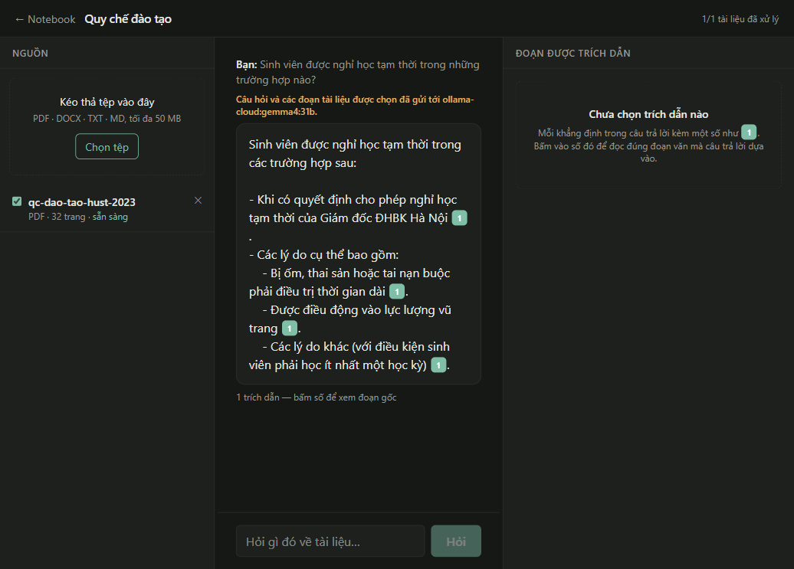
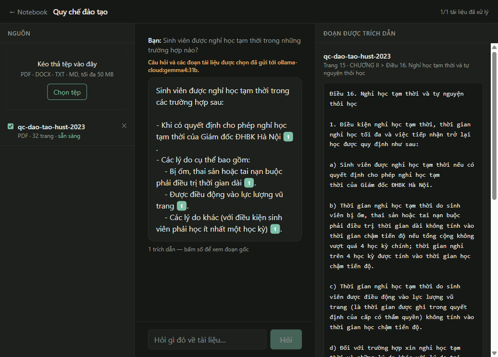

# Tải tài liệu lên rồi hỏi được — vòng lặp đầy đủ

| | |
|---|---|
| Ngày | 2026-08-23 |
| Phạm vi | US-002 → US-006, US-016, và cả đường hỏi đáp |
| Kiểm chứng | Trình duyệt thật qua Playwright, không phải test giả lập |
| Mô hình | `bge-m3` · `bge-reranker-v2-m3` (CPU) · `gemma4:31b` (Ollama Cloud) |
| Test | **379 xanh**, ruff sạch, TypeScript sạch, Next build sạch |

## Việc đã làm được

Đăng ký tài khoản → tạo notebook → tải lên **quy chế đào tạo ĐHBK Hà Nội 2023,
32 trang PDF** → xem tiến trình xử lý → hỏi bằng tiếng Việt → nhận câu trả lời
hiện dần kèm chip trích dẫn → bấm chip để đọc nguyên văn đoạn gốc.

Tài liệu ra **114 đoạn**, INV-1 giữ nguyên.



Bấm chip `[1]` thì cột phải hiện đúng chỗ câu trả lời dựa vào:



Đây là điểm đáng chú ý nhất của ảnh thứ hai: câu trả lời nói *"khi có quyết định
cho phép nghỉ học tạm thời của Giám đốc ĐHBK Hà Nội"*, và đoạn gốc ở **Trang 15
› CHƯƠNG II › Điều 16** viết đúng như vậy. Người dùng không phải tin — họ đọc
được.

## Hai lỗi thật, cả hai đều giết streaming

Đo bằng cách bấm giờ từng sự kiện SSE. Ban đầu **cả tám sự kiện của một lượt hỏi
cùng đến ở giây thứ 22** — tức là streaming không hề chảy, dù mã phía sau đã viết
đúng kiểu async generator.

### Mã đồng bộ tốn CPU nằm trong async generator

`retrieve()` và `decide()` là mã đồng bộ: nhúng câu hỏi rồi cho cross-encoder
chấm hàng chục cặp. Gọi thẳng trong một `async def ... yield` thì chúng **khoá
vòng lặp sự kiện**, và hậu quả nặng hơn vẻ ngoài:

* Mọi sự kiện đã `yield` trước đó nằm kẹt trong bộ đệm tới khi khối chặn xong.
  Nhãn *"đang tìm trong tài liệu"* không bao giờ kịp hiện.
* Cả tiến trình **ngừng phục vụ mọi request khác** trong ngần ấy giây — một
  người hỏi là những người còn lại phải đợi.

Đẩy hai lời gọi đó sang luồng riêng bằng `asyncio.to_thread`. Phiên SQLAlchemy đi
theo, và điều đó an toàn vì mỗi lượt hỏi có phiên riêng: thứ SQLAlchemy cấm là
dùng **đồng thời**, không phải dùng lần lượt từ hai luồng.

Sau khi sửa, đo trực tiếp vào FastAPI:

```
0.2s  session · meta · status(retrieving)
0.4s  status(reranking)
23.1s status(generating)
26.3s token đầu tiên
```

### `rewrites()` của Next.js đệm toàn bộ phản hồi

Nhưng qua giao diện thì vẫn đến cùng lúc. Cùng câu hỏi, hai đường:

| | Sự kiện đầu | Token đầu |
|---|---|---|
| Trực tiếp FastAPI | **0,2 s** | 26,3 s |
| Qua `rewrites()` của Next | 27,8 s | 27,8 s |

Proxy của Next gom cả phản hồi rồi mới trả một lượt. Dùng `rewrites()` là cách
hiển nhiên để tránh CORS — và nó **giết hẳn** một tính năng: US-012 AC-2 đặt mốc
token đầu tiên dưới ba giây, mốc đó không thể đạt qua proxy dù backend nhanh đến
đâu.

Bỏ proxy, trình duyệt gọi thẳng FastAPI, bật CORS. Một dòng cấu hình đổi lấy
streaming.

## Ba lỗi khác gặp lúc dựng

**ORM tháo liên kết trước khi xoá cha.** Xoá notebook thì SQLAlchemy chạy
`UPDATE sources SET notebook_id = NULL` để tháo con ra trước — mà cột đó
`NOT NULL`. Lược đồ đã khai `ON DELETE CASCADE` từ migration 0001; thiếu
`passive_deletes=True` nên ORM không biết mà nhường việc cho cơ sở dữ liệu.

**Worker đọc bản ghi trước khi transaction commit.** Nó ghi *"không tìm thấy
nguồn"* rồi im lặng, tài liệu kẹt ở `queued` vĩnh viễn. Thứ tự giữa lúc dọn
dependency và lúc chạy background task không được bảo đảm, nên endpoint commit
tường minh trước khi xếp việc.

**Trạng thái bịa ra ngoài `CHECK` constraint.** Worker đặt `downloading` và
`extracting`; lược đồ chỉ cho `queued · parsing · ocr · chunking · embedding ·
ready · failed`, nên **mọi** lần cập nhật tiến trình đều bị Postgres từ chối. Bộ
từ vựng đã chốt ở `SPEC-v1.md` §4.2 — worker dùng đúng nó thay vì nới ràng buộc.

## Còn lại

- **US-015 tô sáng theo toạ độ.** Trích dẫn đã mang `char_start`/`char_end` và
  `bbox`; cột phải hiện nguyên văn đoạn nhưng chưa vẽ được vùng tô sáng trên
  trang PDF. Cần trình đọc PDF.js — và cần bạn xác nhận spike S3 trước.
- **US-017 xem trước PDF** trong cột phải.
- **US-021 worker Celery.** Hiện dùng `BackgroundTasks` của FastAPI: đúng tiến
  trình, nên một tài liệu lớn vẫn chiếm tài nguyên của máy chủ API.
- **Độ trễ trên CPU.** Token đầu tiên 26 giây, gần hết là cross-encoder. Mốc ba
  giây của US-012 AC-2 chỉ đo được trên máy đích có GPU.
